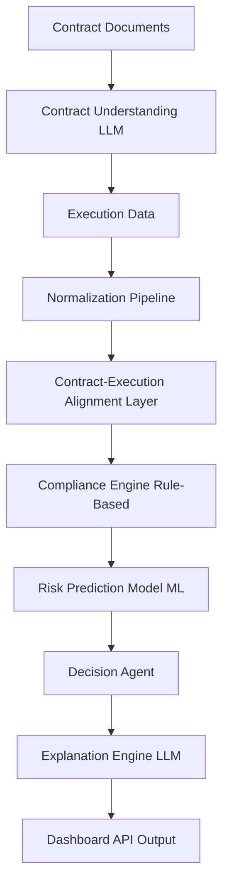

# ContractGuard AI  
## Intelligent Infrastructure Contract Compliance & Risk System  

---

# 📌 1. PROJECT OVERVIEW

ContractGuard AI is an end-to-end system designed to bridge the gap between **contractual agreements** and **real-world project execution** in infrastructure projects such as roads, bridges, and construction.

### 🎯 Core Objective
To automatically:
- Extract structured rules from contracts  
- Monitor execution data  
- Detect violations  
- Predict future risks  
- Recommend actions  
- Generate human-readable explanations  

---

# 🔁 2. SYSTEM FLOW (END-TO-END)

---

# 🧱 3. SYSTEM COMPONENTS (DETAILED)

---

## 🔵 MODULE 1: CONTRACT UNDERSTANDING

### Purpose
Convert unstructured contract text into structured rules.

### Input
- Contract documents (from CUAD dataset)

### Processing
- Extract:
  - Tasks  
  - Deadlines  
  - Grace periods  
  - Penalties  
  - Conditions  

### Output Structure
Task | Deadline | Grace | Penalty | Conditions
-----|----------|-------|---------|------------

### Key Challenge
Contracts are ambiguous and require structured interpretation.

---

## 🟣 MODULE 2: EXECUTION DATA PIPELINE

### Purpose
Standardize real-world execution datasets.

### Input
- Construction datasets (multiple sources)

### Processing
- Clean data  
- Normalize columns  
- Map different formats into a unified schema  

### Output
Project ID | Task | Duration | Cost | Resources | Delay Label
-----------|------|----------|------|-----------|-------------

---

## 🔴 MODULE 3: CONTRACT–EXECUTION ALIGNMENT (CORE NOVELTY)

### Purpose
Match contract-defined tasks with execution data tasks.

### Why Needed
No dataset directly links contract clauses with execution logs.

### Processing
- Compare contract tasks with execution tasks  
- Perform semantic matching  
- Assign confidence scores  

### Output
Contract Task ↔ Execution Task (Confidence Score)

---

## 🟢 MODULE 4: COMPLIANCE ENGINE

### Purpose
Detect violations by comparing rules with execution.

### Logic
- Deadline violations  
- Quality violations  
- Missing tasks  

### Output
Task | Violation Type | Severity | Description
------|----------------|----------|-------------

### Important
Must be deterministic (no randomness).

---

## 🟡 MODULE 5: RISK PREDICTION MODEL

### Purpose
Predict future violations using machine learning.

### Input
- Risk datasets (India + DoD)
- Execution features

### Output
LOW / MEDIUM / HIGH risk

### Key Aspects
- Feature engineering  
- Model evaluation  
- Generalization  

---

## 🟠 MODULE 6: DECISION AGENT

### Purpose
Take actions based on system outputs.

### Logic
- If violation → penalty  
- If high risk → alert  
- If both → escalation  

### Output
Decision | Action | Priority
---------|--------|----------

---

## 🧠 MODULE 7: EXPLANATION ENGINE

### Purpose
Explain system decisions in human language.

### Input
- Violations  
- Risk predictions  
- Context data  

### Output
- Cause  
- Impact  
- Reasoning  

---

## 📊 MODULE 8: DASHBOARD

### Purpose
Visualize system outputs.

### Displays
- Violations  
- Risk levels  
- Project status  
- Decisions  

---

# 📦 4. DATASET DOCUMENTATION

---

## 🔵 CONTRACT DATA

### CUAD (Contract Understanding Atticus Dataset)

### Description
A legal contract dataset with clause-level annotations.

### Contents
- Contract text  
- Clause classifications  

### Use
- Extract structured contract rules  

---

## 🟣 EXECUTION DATA

### Datasets Included
- Construction Project Dataset  
- Project Performance Dataset  
- Resource Dataset  

### Contents
- Task durations  
- Costs  
- Resources  
- Project phases  

### Use
- Simulate real project execution  

---

## 🔴 RISK DATA

### 🇮🇳 India Road Construction Delay Dataset

#### Description
Survey-based dataset of delay factors.

#### Contents
- Delay categories  
- Severity ratings  

#### Use
- Feature engineering  
- Risk modeling  

---

### 🇺🇸 DoD Construction Dataset

#### Description
Large-scale contract dataset.

#### Contents
- Contract values  
- Timeline  
- Project type  

#### Use
- ML training  
- Risk prediction  

---

## 🟡 CONTEXT DATA

### World Bank Datasets

#### Contents
- Project outcomes  
- Infrastructure performance  
- PPP indicators  

#### Use
- Decision support  
- Explanation grounding  

---

# 🔁 5. UNIFIED DATA SCHEMA

- **Project ID**  
- **Task**  
- **Duration**  
- **Cost**  
- **Delay Label**  
- **Resource Usage**  
- **Risk Factors**  

---

# ⚙️ 6. DATA PROCESSING PIPELINE

### Step 1: Dataset Loading
- Load all datasets from the dataset folder  
- Inspect structure  

### Step 2: Cleaning
- Handle missing values  
- Fix encoding issues  
- Remove duplicates  

### Step 3: Normalization
- Convert all datasets to unified schema  

### Step 4: Validation
- Ensure consistency  
- Check data completeness  

---

# 🧠 7. MACHINE LEARNING PIPELINE

## Objective
Predict project delay risk.

### Steps

#### 1. Feature Engineering
- Duration  
- Cost  
- Resource usage  
- Risk indicators  

#### 2. Target Creation
- Delay vs No Delay  

#### 3. Model Training
- Primary model: XGBoost  
- Baseline model: Random Forest  

#### 4. Evaluation
- Accuracy  
- Precision / Recall  
- F1 Score  
- ROC-AUC  

#### 5. Model Output
LOW / MEDIUM / HIGH

---

# 🔌 8. SYSTEM INTEGRATION

### Data Flow
- Contracts → rules  
- Execution → logs  
- Risk model → predictions  
- Compliance → violations  
- Agent → decisions  
- Explanation → output  

### API Layer
Provides endpoints for:
- Contract processing  
- Execution input  
- Compliance checking  
- Risk prediction  
- Decision output  
- Dashboard data  

---

# 🧪 9. TESTING STRATEGY

### Required Test Cases
1. No violation  
2. Deadline violation  
3. High risk prediction  
4. Multiple violations  

### Validation Goals
- Accuracy of detection  
- Model performance  
- End-to-end consistency  

---

# ⚠️ 10. KEY CHALLENGES

### 1. Dataset mismatch  
Different formats require normalization  

### 2. Missing data  
Especially in large datasets  

### 3. No direct linkage  
Contract and execution are separate  

### 4. Model generalization  
Avoid overfitting  

---

# 🎯 11. FINAL SYSTEM EXPECTATIONS

The system must be:

- Fully integrated  
- Data-driven  
- Explainable  
- Accurate  
- Scalable  

---

# 🚀 12. EXECUTION ROADMAP

### Phase 1  
Dataset understanding + schema  

### Phase 2  
Contract + execution pipeline  

### Phase 3  
Alignment + compliance  

### Phase 4  
ML model  

### Phase 5  
Integration  

### Phase 6  
Testing + refinement  

---

# 🧠 FINAL NOTE

This project is a **complete intelligent system** combining:

- Data engineering  
- Machine learning  
- Natural language processing  
- System design  

The strength of this system depends on:

- Correct data handling  
- Strong model design  
- Clean integration  

---
